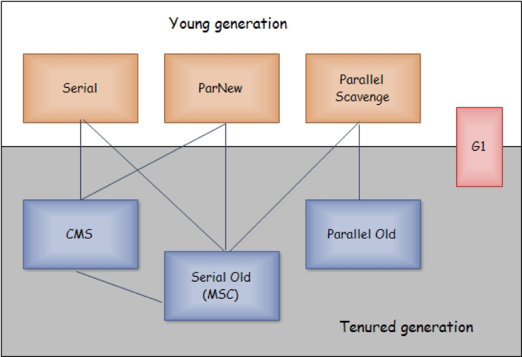

# JVM Tuning
    很久以前的PPT，乘着最近对JVM的一次调优机会，再整理出来，分享一下。  
       
# Hotspot JVM Architecture v.s. Memory Layout Of a Process     
  了解JVM之前，我们首先可以对操作系统的进程的内存布局作个了解，JVM作为操作系统的一个进程，大致上还是遵从了
进程的内存布局，并且两着直接有一定的关系。

    

每个方法被执行的时候都会同时创建一个栈帧（Stack Frame）用于存储局部变量表、操作栈、动态链接、方法出口
等信息。每一个方法被调用直至执行完成的过程，就对应着一个栈帧在虚拟机栈中从入栈到出栈的过程。

VmLck:正在锁住的物理内存
VmHWM：使用的物理内存的峰值
VmRSS：当前正在使用的物理内存
VmData：

reference: <https://docs.oracle.com/javase/8/docs/technotes/guides/vm/gctuning/toc.html>

##Introduction

* JVM （Java HotSpot virtual machine)提供了多个GC (Garbage Collectors)
* Java SE 可以根据应用选择合适的GC，但是这种选择不一定对每个应用都是可选的？？？
* GC 是 内存管理的工具， 它可以通过下面的操作来达到自动管理内存的目的：
	- 将objects 分配到新生代，将较老的objects推入老生代
	- 通过并行的标识阶段（concurrent/parallel marking phase) 找到old generation 里面的存活的objects。 当总的堆内存占有率达到默认的阈值事，JVM将会触发这个阶段。
	- 通过并行拷贝parallel copying， 压缩live objects来提升free memory。
* 什么时候GC的选择有着重大的影响呢？
	- 对某些应用而言，也许没有任何影响。比如：在gc频率适度，gc pause的时间可以接受的情况下，应用程序能够运行良好。
	- 但是对大多数应用，特别是处理大数据量(几G)，多线程，高事务并发的应用而言，gc的选择非常重要。
 
 ## JVM tuning parameters

* Maximum Pause Time:This is interpreted as a hint to the garbage collector that pause times of <nnn> milliseconds or less are desired.
	- -XX:MaxGCPauseMillis=<nnn>
* Throughput:The throughput goal is measured in terms of the time spent collecting garbage and the time spent outside of garbage collection (referred to as application time).
	- XX:GCTimeRatio=<nnn>.
	- The ratio of garbage collection time to application time is 1 / (1 + <nnn>). For example, -XX:GCTimeRatio=19 sets a goal of 1/20th or 5% of the total time for garbage collection.
* -verbose:gc, -XX:+PrintGCDetails,-XX:+PrintGCTimeStamps
* the total heap size
	- -Xms<min>
	- -Xmx<max>
 	- -XX:MinHeapFreeRatio=<minimum>
	- -XX:MaxHeapFreeRatio=<maximum>
* the young generation size
	* NewRatio: the ratio between the young and tenured generation is 1:3 -XX:NewRatio=3
	* NewSize:the size from below
	* MaxNewSize:the size from above
* Survivor Space Sizing
	- SurvivorRatio: -XX:SurvivorRatio=6 sets the ratio between eden and a survivor space to 1:6
	- XX:+PrintTenuringDistribution
* Available Collectors
	- -XX:+UseSerialGC
	- -XX:-UseParallelOldGC
	- -XX:+UseConcMarkSweepGC
	- -XX:+UseG1GC
* java -XX:+PrintFlagsFinal <GC options> -version | grep MaxHeapSize

## JVM调优的目标是什么？

Pauses are the times when an application appears unresponsive because garbage collection is occurring.
Throughput is the percentage of total time not spent in garbage collection considered over long periods of time. Throughput includes time spent in allocation (but tuning for speed of allocation is generally not needed).
If the throughput and maximum pause time goals have been met, then the garbage collector reduces the size of the heap until one of the goals (invariably the throughput goal) cannot be met. The goal that is not being met is then addressed.

* ___Maximum Pause Time Goal___ 设置最大停顿时间  
-XX:MaxGCPauseMillis=<nnn>
* ___Throughput Goal___最大吞吐率目标
    * -XX:GCTimeRatio=<nnn>.
    * Throughput=1 / (1 + <nnn>)
    -XX:GCTimeRatio=19 sets a goal of 1/20th or 5% of the total time for garbage collections
* ___Footprint (Heap Size)___

## GC Logs  
-XX:PrintGCDetails  -Xloggc 
 eg: -verbose:gc -XX:+PrintGCDetails  -XX:+PrintGCTimeStamps  -Xloggc:/logs/gc.log

https://blog.csdn.net/f59130/article/details/74013460

## 堆栈大小调优
**Xms Xmx NewRatio NewSize MaxNewSize SurvivorRatio** 
https://docs.oracle.com/javase/8/docs/technotes/guides/vm/gctuning/toc.html   

    

  

#如何查看分析JVM问题
https://mp.weixin.qq.com/s?__biz=MzAxMzQ3NzQ3Nw==&mid=2654249460&idx=3&sn=7233b88a667c24cad4d9ef99a9a28112&chksm=8061f2feb7167be8b21d29460df7e5f15a802f00e5ce2288c57b6410fb67b64b09dceac25035&scene=0&key=a226a081696afed0ced8883ddef645ec886e24bc65882754aad279d07970c51c599395c5e971e56fb42d3ad73ecac99ea91dcfac61c6eaa5b14d06eb267d46c03ab005b1899892bfa5a99d21f0cf1783&ascene=0&uin=MjEzNDU4ODUyMw%3D%3D&devicetype=iMac+MacBookPro12%2C1+OSX+OSX+10.11.6+build(15G1108)&version=12010210&nettype=WIFI&fontScale=100&pass_ticket=lQkdjKFceno65864XSxiVmIPnc19RTijAJnu8ZWf%2BJPjCtoSCdDRCp%2F9MrMzDXqV

#gc算法
* Serial  -XX:+UseSerialGC
    - Single processor 
    - Simple and efficient relatively
    - Client
    - Multiprocessors for applications with small data (<100M)
    
* Parallel -XX:+UseParallelGC
    - Application with Medium-size/large-size data size
    - Throughput goal (Throughput collector)
    - Multiprocessors

* Concurrent-Mark-Sweep -XX:+UseConcMarkSweepGC  
    - Applications with medium-size/large-size data sets
    - Response time is more important than overall throughput
    - Only use in old generation
    - will be replaced by G1  

算法主要步骤: 
    - Initial mark(STW, single-thread) :Stop all application threads, identify the set of objects reachable from roots, and then resume all application threads.
    - Concurrent mark : Concurrently trace the reachable object graph, using one or more processors, while the application threads are executing.
    - Concurrent pre-clean[part of remark work] :
    - Remark(STW, multi-thread) : Stop all application threads and retrace sections of the roots and object graph that may have been modified since they were last examined, and then resume all application threads.
    - Concurrent sweep : Concurrently sweep up the unreachable objects to the free lists used for allocation, using one processor.
    - Concurrent reset: Concurrently resize the heap and prepare the support data structures for the next collection cycle, using one processor.

* G1 -XX:+UseG1GC    
    

    - Garbage-First, partition heap to equally sized regions
    - Multiprocessor machines with large memories(heapsize>6g)
    - Meets gc pause time goals with high probability while achieving high throughput
    - More than 50% of the Java heap is occupied with live data.
    - The rate of object allocation rate or promotion varies significantly.
    - The application is experiencing undesired long garbage collection or compaction pauses (longer than 0.5 to 1 second).

G1算法主要步骤：
- Initial marking phase (STW)       
   mark roots, This phase is piggybacked on a normal (STW) young garbage collection.  
- Root region scanning phase 
   scans survivor regions marked during the initial marking phase for references to the old generation and marks the referenced objects
concurrently ,must complete before the next STW young garbage collection can start.
- Concurrent marking phase  
    GC finds reachable (live) objects across the entire heap
    can be interrupted by STW young garbage collections
- Remark phase (STW)         
    Completes marking (SnapshotAtTheBeginning[SATB] buffer (other GC use dirty card algorithm)) ,  traces unvisited live objects
Reference processing
- Cleanup phase  
    Liveness accounting and identify completely free regions (STW)      
    Remembered Set scrubbing (STW)       
    Reset the empty regions and return them to the free list (Concurrent)       

    
 * 如何为选择GC算法
  

   
 

    

