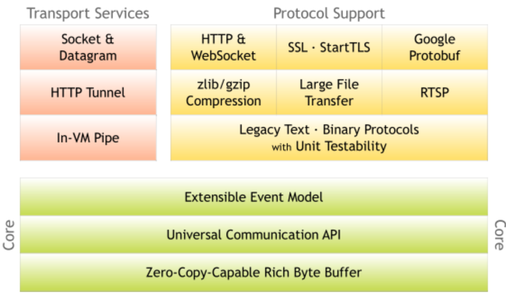

#Netty 源码
<http://netty.io>  
<https://github.com/netty/netty>  

##buffer 实现
##Channel 实现
##event -driven
##网络事情响应和处理
##编码解码

#Netty 使用
http://blog.csdn.net/dc_726/article/details/48978891

#Netty 源码参考
https://segmentfault.com/a/1190000007282628