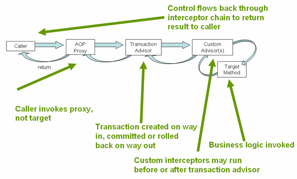

#Transaction
http://hrps.me/2016/11/03/spring-transaction/
https://docs.spring.io/spring/docs/current/spring-framework-reference/data-access.html#transaction

##Global Transactions
全局事物允许配多个数据源，典型的关系数据库和**消息队列**
TODO:消息队列
spring transaction abstraction的抽象的关键在***transaction strategy***.
其定义在PlatformTransaction里面

###注意
* When using proxies, you should apply the @Transactional annotation only to methods with public visibility. 
If you do annotate protected, private or package-visible methods with the @Transactional annotation, no error is raised, 
but the annotated method does not exhibit the configured transactional settings. Consider the use of AspectJ (see below) if you need to annotate non-public methods.
* Spring recommends that you only **annotate concrete classe**s (and methods of concrete classes) with the @Transactional annotation, 
as opposed to annotating interfaces. You certainly can place the @Transactional annotation on an interface (or an interface method), 
but this works only as you would expect it to if you are using interface-based proxies. The fact that **Java annotations are not inherited** from interfaces means that if you are using class-based proxies ( proxy-target-class="true") or the weaving-based aspect ( mode="aspectj"),
 then the transaction settings are not recognized by the proxying and weaving infrastructure, and the object will not be wrapped in a transactional proxy, which would be decidedly bad.
* In proxy mode (which is the default), **only external method calls** coming in through the proxy are intercepted. 
This means that self-invocation, in effect, a method within the target object calling another method of the target object, will not lead to an actual transaction at runtime even if the invoked method is marked with @Transactional. 
Also, the proxy must be fully initialized to provide the expected behaviour so you should not rely on this feature in your initialization code, i.e. @PostConstruct. 
* @EnableTransactionManagement and <tx:annotation-driven/> **only looks for @Transactional on beans in the same application context** they are defined in. 
This means that, if you put annotation driven configuration in a WebApplicationContext for a DispatcherServlet, 
it only checks for @Transactional beans in your controllers, and not your services. See MVC for more information.
* 如果代理类出了问题，你还有自己控制代理类的产生，Using the ProxyFactoryBean to create AOP proxies
  见https://docs.spring.io/spring/docs/current/spring-framework-reference/core.html#aop-aj-ltw
* 使用AspectJ，weaving-base proxy:Weaving in general is a programmatic transformation which essentially means processing of a code to produce a desired output.  

