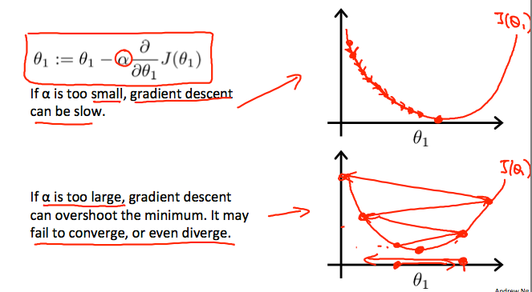

#Machine Learning Ng课程学习笔记
Andrew Ng的课程真是通俗易懂，读了几年的数据挖掘，很多东西还是一知半解。五年之后上了coursera温习下，发现很多基本东西都通了。
<https://www.coursera.org/learn/machine-learning/lecture/8SpIM/gradient-descent>

#线性回归Linear Regression  
1. 假设函数：
hypothesis h(x): 是特征变量 x 与标签 y 之间的函数，x 是自变量， 参数是固定的。我们的目标就是求这个参数。  
2. cost function: J 自变量是假设函数的参数，即表示的参数的变化如何影响最终的值得。这个值越小，则意味着该参数所形成的最终h(x）在训练集上的总的差距最小。  
3. 梯度下降 Gradient Descent：是求 cost function 最小值的一种方式。在同一个圈上的点，所得的 cost function值相同。    

```So we have our hypothesis function and we have a way of measuring how well it fits into the data. Now we need to estimate the parameters in the hypothesis function. That's where gradient descent comes in.``` 


 
笔记：梯度 可以对应数学中求导（derivative）来理解（求偏导）。导数的含义可以对应物理里面的加速度，反应的是速度的变化。如果再二次求导，则意味着反应参数的变化速度了。这也就是为啥很多公式迭代逼近最终参数的方式都是先设一个初始值，然后将偏导作为增量加入下次迭代中的基本原理。  
在每次迭代中，需要同时加上所有参数的变化，而不是一次一个参数依次变化。
  

4. Learning Rate 学习曲线：
*  learning rate 反应的参数的变化，也就是参数的斜率slope，它的大小觉得了 J 的收敛速度。
*  为正时，表示参数递增至收敛，为负数，表示参数递减至收敛

* learning rate 设置过小，影响收敛速度，设置过大则容易偏离最终值。

* learning rate 为固定值既可以保证会朝着收敛的方向**慢慢**逼近，无需每次再修改调整。'

  
  
5. 矩阵与向量 Matrice and Vector
	* 向量是 n*1 维矩阵，只有一列
	* A*y：可以看成线程函数中数据集与参数，相成正好表示了线程函数（A 是矩阵，y 是向量）
	* A*B： B 则是 m 个向量，也就表示不同参数下的不同输出组成的矩阵。

6. Feature Scaling
  We can speed up gradient descent by having each of our input values in roughly the same range. This is because θ will descend quickly on small ranges and slowly on large ranges, and so will oscillate inefficiently down to the optimum when the variables are very uneven.
	* 不 scale 的话，J函数将会瘦长，难以收敛
	* 不 scale 的话，各个量纲不同，导致部分特征影响过大
	* 有哪些方法：见数据挖掘书 (Mean Normalization)
	Note that dividing by the range, or dividing by the standard deviation, give different results. The quizzes in this course use range - the programming exercises use standard deviation.
	
	Feature scaling involves dividing the input values by the range (i.e. the maximum value minus the minimum value) of the input variable, resulting in a new range of just 1. Mean normalization involves subtracting the average value for an input variable from the values for that input variable resulting in a new average value for the input variable of just zero. 
	

	

#逻辑回归Logistic Regression
Note：
1）线性回归用于预测连续值。分类问题是类似线性回归，但其 y 值为有限的离散值。
2）逻辑回归则用于分类。因为分类问题可能不是一个线性函数。

##Overfitting/Uderfitting
* Underfitting, or high bias, is when the form of our hypothesis function h maps poorly to the trend of the data. It is usually caused by a function that is too simple or uses too few features.  
* overfitting, or high variance, is caused by a hypothesis function that fits the available data but does not generalize well to predict new data. It is usually caused by a complicated function that creates a lot of unnecessary curves and angles unrelated to the data.

###How to addressing overfitting
1. 减少特征
1）Manually select which features to keep.
2） Use a model selection algorithm (studied later in the course).

2. Regularization
1） Keep all the features, but reduce the magnitude of parameters θj.
2）Regularization works well when we have a lot of slightly useful features.


#神经网络Neural Network
##为啥需要神经网络


#支持向量机 Support Vector Machines

# 

#实践Note
 Mac 上安装 octave，依赖gnuplot,XQuartz
note：
1）brew install gnuplot --with-x11
2）XQuartz:官网直接下载 dmg 即可。
3）需要重启才能使x11生效
4）修改 octaverc 文件
我的是在：/usr/local/octave/3.8.0/share/octave/site/m/startup/octaverc
下面，加入
graphics_toolkit('gnuplot')
setenv("GNUTERM","x11")