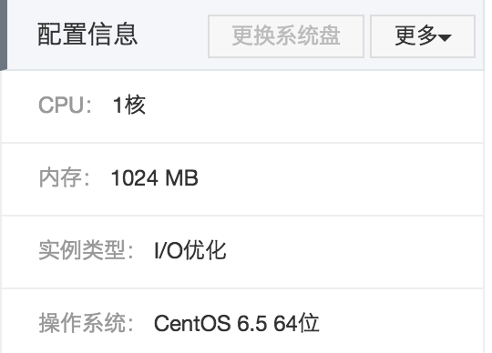

#如何用阿里云ECS建VPN访问外网
##申请阿里云 ECS 服务器		
这块很简单，注册账号，充值。选择云服务器的各种配置，不同配置价格不同。第一次试用，选了个最便宜的一个月.   
如果第一次接触阿里云的话，这里给出一个有图的的参考文档: 

<http://www.123haitao.com/question/67945?notification_id-263877__rf-false__comment-2__item_id-94748__answer_id-94748__single-TRUE>  

本文实例中选的是配置是:  

##安装VPN，设置防火墙
检查是是否能装pptp
参考：<http://jingyan.baidu.com/article/af9f5a2d25513e43140a45fb.html>
###安装PPP
**yum install -y ppp iptables**

###安装 pptp
此处注意，需要根据所安装的ppp版本，来安装对应得 pptp。  

1. 查看安装的 ppp:  
参考：<http://www.dabu.info/centos6-4-structures-pptp-vpn.html>		
 
	**yum list installed ppp**  

2. 加入yum源  
	**rpm -Uvh http://poptop.sourceforge.net/yum/stable/rhel6/pptp-release-current.noarch.rpm**  

3. 然后yum 安装  
	**yum install pptpd**  

###各种配置	

**主要参考资料：**
<http://czbinghe.blog.51cto.com/9824423/1684854>

比较容易出错的是iptables的配置

如果你之前已经尝试过，导致 iptables 里面已有太多规则，可以执行下面的语句将其情况，重新开始。如果是第一次，可以 skip 这一步：  
可以先检查下现有的当前的状态：  

**service iptables status**

清空：  
**iptables -F**  
**iptables -X**  
**iptables -Z**  
**iptables -t nat -F**  
**iptables -t nat -X**  
可以再 service iptables status 再 check 下。

防火墙规则设置：最重要的是最后一条

- iptables -A INPUT -i lo -j ACCEPT
- iptables -A INPUT -p gre -j ACCEPT
- iptables -A INPUT -m state --state ESTABLISHED -j ACCEPT
- iptables -A INPUT -p icmp -m icmp --icmp-type 8 -j ACCEPT
- iptables -A INPUT -p tcp --dport 22 -j ACCEPT
- iptables -A INPUT -p tcp --dport 80 -j ACCEPT
- **iptables -t nat -A POSTROUTING -s 192.168.0.0/24 -o eth1 -j MASQUEREAD**  

**关于 mtu 的问题影响上网的原因（如果能连上 vpn，但不能上网）**  
这个问题不知道是不是最初那个影响上网的原因，网上各种教程，讲了设置各个不同的值都有。但是最终在我的服务器上正常工作的是：1472  
具体步骤：  
编辑 /etc/ppp/ip-up,在 exit 0前面添加配置 mtu 大小。  
**/sbin/ifconfig ppp0 mtu 1472**   
exit 0  

修改后，注意重启 pptpd
service pptpd restart

如果客户端连接成功的话，ifconfig 之后，显示mtu 为1500则基本正常了：

ppp0: flags=8050<POINTOPOINT,RUNNING,MULTICAST> mtu 1500

##Mac上连接VPN
关键是确保 vpn server 是正常的。
然后到System Preferences->Network,新加网络。
Interface:选 VPN，VPN Type:选 PPTP，Service Name：自己任意。 其他参考网上教程，需要提出的是很多教程里面讲需要修改 wifi 的 dns，我没有修改，仍然可以用。

然后，ping www.google.com 检查下。

##window7连接VPN 
##iPhone手机连接VPN
##iPad连接VPN
