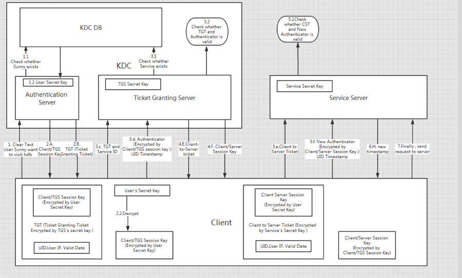

#SSL
一般用于互联网直接传输数据加密和客户端与服务器间身份认证。会影响数据传输的性能。
<http://kb.cnblogs.com/page/162080/>
#Kerberose
域内客户端与服务间互相的身份认证。
<http://blog.csdn.net/wulantian/article/details/42418231>

##hdfs kerberose:

##Cent7上配置 KDC
<https://www.certdepot.net/rhel7-configure-kerberos-kdc/>  
<http://web.theurbanpenguin.com/configuring-a-centos-7-kerberos-kdc/>  
<http://debugo.com/kerberos/>  
<http://blog.csdn.net/kkdelta/article/details/46633557>  
###碰到的问题：  
  
* cent7没有安装rngd:
1. yum -y install rng-tools
2. 启动.
<http://web.theurbanpenguin.com/centos-7-rngd-will-not-start/>
