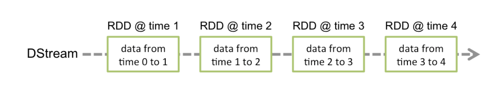
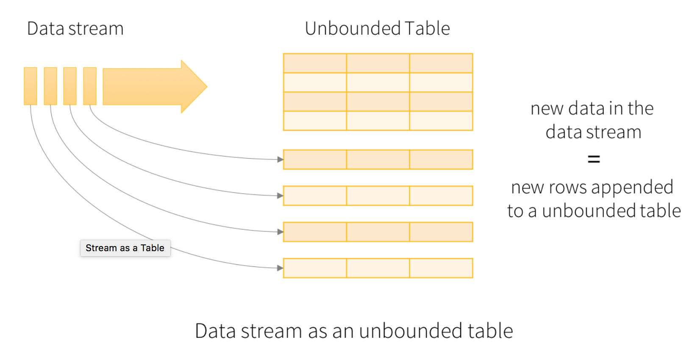

#Spark Streaming

Spark Streaming is an extension of the core Spark API that enables scalable, high-throughput, fault-tolerant stream processing of live data streams。  

* 输入可以是 kafka，flume,kinesis,tcp sockets等。
* 中间的处理可以是由map,reduce, join,window等组成的复杂算法，也可以是machine learning 和图处理算法。
* 输出可以是文件系统，数据库，live dashboards.

##Basic Concepts
**Discretized Stream** or **DStream**:DStream is represented by a continuous series of RDDs
	


* Batch Duration: The time interval at which streaming data will be divided into batches
* Window: 
 - window length - The duration of the window (3 in the figure, 3 batch interval).
 - sliding interval - The interval at which the window operation is performed (2 in the figure, 2 batch invetval ).
 

 
##stream process 系统，一般包括三个步骤：  
 
1. Receiving the data: The data is received from sources using Receivers or otherwise.
依赖 source 是不是保证 exactly once。

2. Transforming the data: The received data is transformed using DStream and RDD transformations.
spark streaming 由于 RDD 的特性能保证该步骤的 exactly once。

3. Pushing out the data: The final transformed data is pushed out to external systems like file systems, databases, dashboards, etc.
依赖 output 的外部系统是不是幂等的，是不是支持 transaction（或者自己实现来保证重复些的数据会被重写，而不是重复写，为该份数据产生同一个可表示的 id，并且在多个动作试图产生对同一份数据写时，保证原子写）。


##RDD Lifecycle in Spark Streaming
###In Batch Duration  
* Basically, spark jobs is triggered by timer in spark streaming, and all rdds of  DStream in a batch duration will be cleaned from memory after spark job(action) finish. 
* If we persist one of DSStream in a job (calling DStream.persist), it will be persisted as shown  on Storage on Spark UI, but will be removed later after job is finished automatically.

Yon can see from log: BlockManager: Removing RDD xxx
*	There is one workaround to ask spark streaming to hold all rdds generated from different batches by calling ssc.remember. 

eg: we let spark streaming keep all rdds in last 24h by calling ssc.remember(Minutes.apply(60*24))  

From Log: No rdd is removed now during two batch durations.
And on Spark UI, all rdds generated from different batched in the 24h will be shown on Storage:


###In Window

* The rdds generated in successive two windows will be continuously stored in memory or files. 



##Possible ways to control rdd's lifecycle  

Possible ways to control rdd's lifecycle  
 
*	Window Operations  
 rdds in previous batch can be obtained by current batch? Can we build the relations between previous batch and current batch, then union them and generated new DStream ?
  http://stackoverflow.com/questions/30048684/spark-streaming-data-sharing-between-batches
	- Conclusion after research:** 
The rdds in successive 2 batches are reserved in the sliding window's lifecycle. It is so depend on window size (i.e. time-dependent)  
 
*	Transform Operation  
The transform operation (along with its variations like transformWith) allows arbitrary RDD-to-RDD functions to be applied on a DStream. It can be used to apply any RDD operation that is not exposed in the DStream API. For example, the functionality of joining every batch in a data stream with another dataset is not directly exposed in the DStream API. However, you can easily use transform to do this. This enables very powerful possibilities. For example, one can do real-time data cleaning by joining the input data stream with precomputed spam information (maybe generated with Spark as well) and then filtering based on it.
	- Conclusion after research:  
Similar to foreachRDD as bellow. 
 
*	foreachRDD  
The most generic output operator that applies a function, func, to each RDD generated from   the stream. This function should push the data in each RDD to an external system, such as saving the RDD to files, or writing it over the network to a database. Note that the function func is executed   in the driver process running the streaming application, and will usually have RDD actions in it   that will force the computation of the streaming RDDs.

	- Conclusion after research:
		- The original rdds generated by spark streaming will be deleted automatically as well by Timer even we try to store the references for each rdds "in spark context scope (programmatically)".  
	 	- When I try to not keep references for rdds generated by spark streaming, instead, try to generate new ones  in spark context scope  by passing in the streaming rdds and then union all of them:
	 		- The lifecycle of the new rdds can be out of control of the Timer in spark streaming now, in other word, it can be under control by our program according to our demands when we need persistent them and free them.
			- While, the actions which seems be defined in the Spark context scope programmatically actually are still under the control of spark streaming at runtime. i.e., I want the new rdds unions to a global rdd and then record all rdds in one iServer project, but at runtime, no such gobal union rdd will be persisted, the persisted ones are still based on the data in one batch or window.
			- The rdds in spark context can be transfer to generated rdds of DStream, but the rdds in DStream can be "returned back" to spark context.

* QueueInputDStream  
	Queue of RDDs as a Stream: For testing a Spark Streaming application with test data, one can also create a DStream based on a queue of RDDs, using streamingContext.queueStream(queueOfRDDs). Each RDD pushed into the queue will be treated as a batch of data in the DStream, and processed like a stream. 
Build a bridge between RDD in SparkContext and DStream SparkStreaming, check rdd and DStream can be converted to each other, and control rdd's lifecycle in SparkCotext.
  <https://github.com/apache/spark/blob/master/streaming/src/main/scala/org/apache/spark/streaming/dstream/QueueInputDStream.scala>
  <https://github.com/apache/spark/blob/master/examples/src/main/scala/org/apache/spark/examples/streaming/QueueStream.scala>
  
	- Conclusion after research: Similar to foreachRDD
      - The unionRDD in sparkContext can be programed, but never been triggered even we add some action.
      - The orginalRDD from created by sparkContext can be persisted but can't executed any transformations and actions.
      - The queueRDD from sparkContext can be passed to StreamingContext and transformations predefined on streaming rdd can be executed in each batch interval. 

##Starting Process
Starting Process  
  
1. Actions(output operations) have to be predefined before context started. Those actions defined after streaming context started will not be never triggered to execute.  
  
```
16/06/21 19:17:15 ERROR StreamingContext: Error starting the context, marking it as stopped
java.lang.IllegalArgumentException: requirement failed: No output operations registered, so nothing to execute
```
 
2. After Streamingcontext is started, new inputs,transformations, output operations can't be added by another thread.  

```
Exception in thread "Thread-27" java.lang.IllegalStateException: Adding new inputs, transformations, and output operations after starting a context is not supported
    at org.apache.spark.streaming.dstream.DStream.validateAtInit(DStream.scala:220)
```

3. Points to remember (from <http://spark.apache.org/docs/latest/streaming-programming-guide.html->Initializing StreamingContext>):  

*	Once a context has been started, no new streaming computations can be set up or added to it.
*	Once a context has been stopped, it cannot be restarted.
*	Only one StreamingContext can be active in a JVM at the same time.
*	stop() on StreamingContext also stops the SparkContext. To stop only the StreamingContext, set the optional parameter of stop() called stopSparkContext to false.
*	A SparkContext can be re-used to create multiple StreamingContexts, as long as the previous StreamingContext is stopped (without stopping the SparkContext) before the next StreamingContext is created.


##State
<http://www.spark.tc/stateful-spark-streaming-using-transform/>

##Receiver
Reliable Receiver - A reliable receiver correctly sends acknowledgment to a reliable source when the data has been received and stored in Spark with replication.

##Performance Tuning
1. 提高接受数据的并行度
如果 data receiving 是性能瓶颈的话，调整 Datax Receiving 的并行度
   注意：每一个 DStream 将会在每个 worker machine 上创建一个 receiver
   可以配置多个 DStream 分别接受 Source 的不同partition 的数据。
2. 提高数据处理的并行度，即并行 task 的数目。如果发现资源够用，task 相对不足的话。
   配置参数：spark.default.parallelism
3. Data Serialization
   使用 kryo，特定 case 下，根据需要来调整 storage level 来减少 gc。
4. 如果 task lauching overheads 过高，调整 execution mode.
5. 设置合适的 batch interval。
6. 内存调优： DStream 的 persistence level，清除 old data，使用 CMS 垃圾收集器。


## 重点
* 一个 DStream 对应一个 Receiver。Receiver 运行在 executor 里面占用一个 core。spark.cores.max的配置里面要考虑到 receiver占用的 slot。
* DStream,RDD,block关系：
When data is received from a stream source, receiver creates blocks of data. A new block of data is generated every blockInterval milliseconds. N blocks of data are created during the batchInterval where N = batchInterval/blockInterval. **These blocks are distributed by the BlockManager of the current executor to the block managers of other executors.** After that, the Network Input Tracker running on the driver is informed about the block locations for further processing.  
A RDD is created on the driver for the blocks created during the batchInterval. The blocks generated during the batchInterval are partitions of the RDD. Each partition is a task in spark. blockInterval== batchinterval would mean that a single partition is created and probably it is processed locally.

* 多个 DStream产生的多个 RDD，多个 job 的调度：
  If you have two dstreams there will be two RDDs formed and there will be two jobs created which will be scheduled one after the another. To avoid this, you can union two dstreams. This will ensure that a single unionRDD is formed for the two RDDs of the dstreams. This unionRDD is then considered as a single job. However the partitioning of the RDDs is not impacted.
  
* Currently there is no way to pause the receiver. 
Using SparkConf configuration spark.streaming.receiver.maxRate, rate of receiver can be limited.

#Structured Streaming
<http://spark.apache.org/docs/latest/structured-streaming-programming-guide.html>  
Structure Streaming是建立在Spark SQL Engine上 stream processing engine。能确保 exactly-once。  它将 live data stream 视为 可持续 append 的表。
* Structured Streaming is a scalable and fault-tolerant stream processing engine built on the Spark SQL engine. 
* the system ensures end-to-end exactly-once fault-tolerance guarantees through checkpointing and Write Ahead Logs.
* Spark runs it as an incremental query on the unbounded input table

##Output
在 Structured Streaming 里面，不在需要维护 State 了。Output 定义为将结果写入外部存储系统。有三种模式：  

* Complete Mode
* Append Mode
* Update Mode

许多Streaming System需要用户来维护一些不断增长的aggregation结果，但是在Structure Streaming里面Spark 负责维护更新 Result Table （最终输出 output 里面）, 自动对新到来数据根据不同的output模式来更新Result Table 内容。 

##Output Sinks:  

* File sink
* Foreach sink
* Console sink （for debugging)： 数据保存在 driver 的内存里面。
* Memory sink (for debugging): 数据保存在 driver 的内存里面。 

##Sources
built-in sources:  

* File source
* Kafka source
* Socket source


   
    