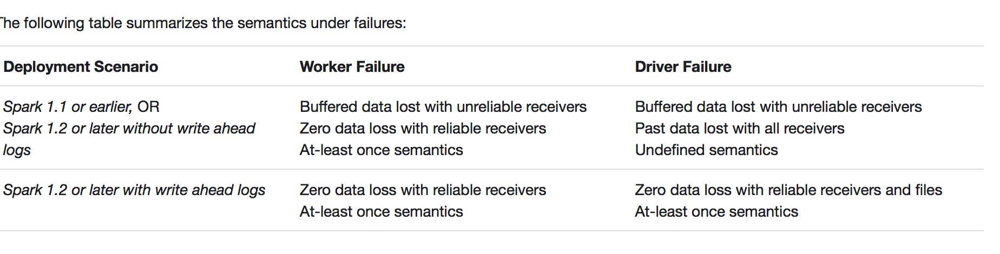

#Check Point 
  sparkContext.setCheckpointDir()  
    
 * spark的checkpoint目录在集群模式下，必须是 hdfs path。因为在集群模式下，实际上 checkpointed RDD 是从executor machines 的 check point files 里面加载而来。

##RDD CheckPoint
* 实际上是利用 hdfs 的冗余来实现高可用。
* 文件rdd-x保持的是 该rdd 的 信息。 
* 如果 rdd1.checkpoint(), 那么 后面依赖 rdd1的 rdd2 在计算时加载 rdd1实际上是从 checkpoint产生的eliableCheckpointRDD而来，（而不是从 rdd0->rdd1重新计算）。
* 如果 rdd1.persist()并且 checkpoint 了，会优先加载 cache 里面的，然后是 checkpoint 里面的。

##Streaming CheckPoint
Streaming里面的 checkpoint 又有其特殊的重要性。除存储某个 DStream 的数据外，还存储了环境相关信息。数据的 checkpoint 的目的同上，为了切断过长的依赖，使后面的操作的依赖更可口。而 metadata 的 checkpoint 是为了更好的恢复 driver。
Spark Streaming 会 checkpoint 两种类型的数据。  
  
* Metadata（元数据） checkpointing - 保存定义了 Streaming 计算逻辑至类似 HDFS 的支持容错的存储系统。**用来恢复 driver**，元数据包括：
配置 - 用于创建该 streaming application 的所有配置
DStream 操作 - DStream 一些列的操作
未完成的 batches - 那些提交了 job 但尚未执行或未完成的 batches  
* Data checkpointing - 保存已生成的RDDs至可靠的存储。这在某些 stateful 转换中是需要的，在这种转换中，生成 RDD 需要依赖前面的 batches，会导致依赖链随着时间而变长。为了避免这种没有尽头的变长，要定期将中间生成的 RDDs 保存到可靠存储来切断依赖链

###什么时候需要启用 checkpoint？
* 有重要的过长的计算依赖
* 用了一些全局的变量，比如stateful，broadcast 等
* 希望从application从 driver 中恢复，注意需要重写 functionToCreateContext
<http://www.jianshu.com/p/00b591c5f623>

* 随着 streaming application 的持续运行，checkpoint 数据占用的存储空间会不断变大。因此，需要**小心设置checkpoint 的时间间隔**。设置得越小，checkpoint 次数会越多，占用空间会越大；如果设置越大，会导致恢复时丢失的数据和进度越多。一般推荐设置为 batch duration 的5~10倍

注意：类 Checkpoint 对象序列化后的数据，在 Spark Streaming application **重新编译**后，再去反序列化 checkpoint 数据就会失败。这个时候就必须新建 StreamingContext。解决方案：对于重要的数据，自行维护，比如 kafka 的offset。  
TODO check: offset checkpoint metadata or hdfs 存 or
 zookeeper存 比较。
 
 
### zero data loss 保证
Write Ahead Log+ reliable receivers（收到数据并且 replicate 之后向 source 确认）
多大程度上保证 zero data loss，跟源本身的实现机制，receiver 的实现也有关系

### 在 deploy 上 checkpoint 也有一些依赖
具体参考：
<http://spark.apache.org/docs/latest/streaming-programming-guide.html#deploying-applications>
 

# Persistent vs CheckPoint
Spark 在生产环境下经常会面临transformation的RDD非常多（例如一个Job中包含1万个RDD）或者具体transformation的RDD本身计算特别复杂或者耗时（例如计算时长超过1个小时），这个时候就要考虑对计算结果数据的持久化。如果采用persist把数据放在内存中，虽然是快速的，但是也是最不可靠的；如果把数据放在磁盘上，也不是完全可靠的！例如磁盘会损坏，系统管理员可能清空磁盘。持久化的方向可以是 persistent 或者 checkpoint。 当两者目的又有所不同。

1. cache/persistent 可以说一方面是为了提速，另一方面是为了当某一重要步骤过长，后面的依赖出错（可能是逻辑错误）情况下，可以无需从头算起。
2. checkpoint：则更多的是为了高可用。其核心另的还是 hdfs 的 replication.其情形是集群总某个点的硬件设备坏掉，例如 persistent 中某个盘坏了，整个应用仍然是可用的。Checkpoint的产生就是为了相对而言更加可靠的持久化数据，在Checkpoint的时候可以指定把数据放在本地，并且是多副本的方式，但是在生产环境下是放在HDFS上，这就天然的借助了HDFS高容错、高可靠的特征来完成了最大化的可靠的持久化数据的方式；

3. Checkpoint是为了最大程度保证绝对可靠的复用RDD计算数据的Spark高级功能，通过checkpoint我们通常把数据持久化到HDFS来保证数据最大程度的安全性；

4. Checkpoint就是针对整个RDD计算链条中特别需要数据持久化的环节（后面会反复使用当前环节的RDD）开始基于HDFS等的数据持久化复用策略，通过对RDD启动checkpoint机制来实现容错和高可用；

加入进行一个1万个步骤，在9000个步骤的时候persist，数据还是有可能丢失的，但是如果checkpoint，数据丢失的概率几乎为0。

理解spark streaming 情形下的数据丢失，对 checkpoint 非常重要
<http://spark.apache.org/docs/latest/streaming-programming-guide.html#fault-tolerance-semantics>
