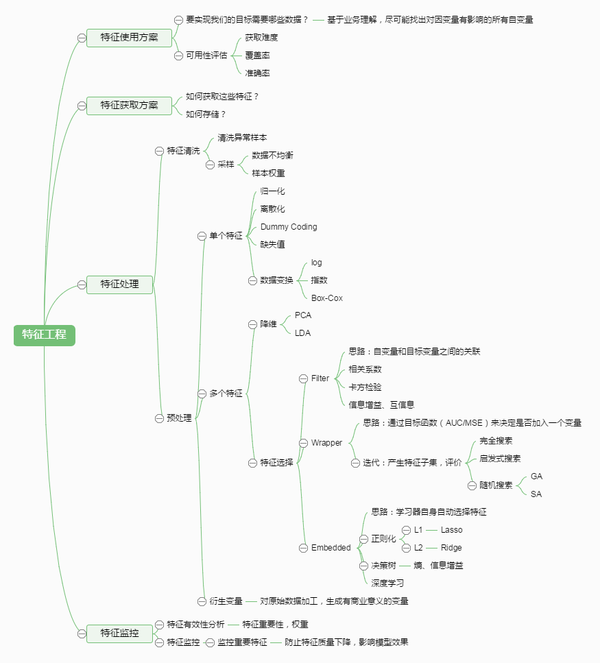

#Spark MLLib架构解析
<http://www.cnblogs.com/shishanyuan/p/4747761.html>
  
官方文档：
 <http://spark.apache.org/docs/latest/ml-features.html>
#数据预处理和特征工程
##数据预处理
**归一化Normalization、标准化Standardization、正则化Regularization**  
<http://blog.csdn.net/zyf89531/article/details/45922151>  
简单来说，标准化是依照特征矩阵的**列**处理数据，其通过求z-score的方法，将样本的特征值转换到同一量纲下。归一化是依照特征矩阵的*行**处理数据，其目的在于样本向量在点乘运算或其他核函数计算相似性时，拥有统一的标准，也就是说都转化为“单位向量”。

总的来说，   

* 归一化是为了消除不同数据之间的量纲，方便数据比较和共同处理，比如在神经网络中，归一化可以加快训练网络的收敛性；  
*    标准化是为了方便数据的下一步处理，而进行的数据缩放等变换，并不是为了方便与其他数据一同处理或比较，比如数据经过零-均值标准化后，更利于使用标准正态分布的性质，进行处理；  
*    正则化而是利用先验知识，在处理过程中引入正则化因子(regulator)，增加引导约束的作用，比如在逻辑回归中使用正则化，可有效降低过拟合的现象。 

**Extracting,transfroming and selecting features**  
<http://spark.apache.org/docs/latest/ml-features.html>
 
* Extraction: Extracting features from “raw” data  
* Transformation: Scaling, converting, or modifying features  
* Selection: Selecting a subset from a larger set of features  
  
这块可以类比为这数据仓库建设阶段的ETL，后面简记为**ETS**。  

非常详细的解释：参考:<https://www.zhihu.com/question/28641663/answer/41653367>  
这张图比较好：  
  

特征选择与降维：  
从处理方式来说，特征选择对原特征要么留，要么舍；而降维会利用到原特征的部分信息。
从目的角度来说，特征选择是选取“有用”的特征，而降维是在性能和效率之间做一个折衷。  

###特征抽取
####文本挖掘:TF-IDF
TF(t,d): Term Frequency,词频,t在文档 d 中出现的**次数**。
DF(t,D): Document Frequency,包含 词t 的**文档数**。
如果仅用TF表示表示词的重要性的话，则很容易过分强调某些出现频繁但是实际上携带信息很少的词。如 a，the 等。如果一个词多个文档总出现频繁，则意味着它并不携带某个特定文档的特别的信息。
IDF:Inverse document frequency,衡量一个词能提供多少信息
   IDF(t,D)=log (|D|+1)/DF(t,D)+1,  
* +1:为了平滑，避免某个词不存在，导致 DF 为0，除以0的情况出现。
#分类
#回归
**线性回归和逻辑回归**
<http://blog.csdn.net/viewcode/article/details/8794401>

