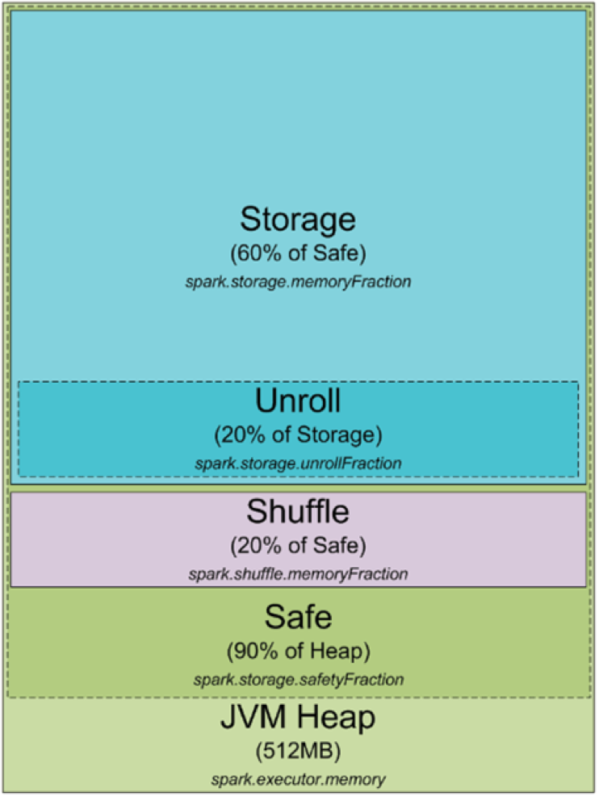

#Spark Performance
##Memory Tuning
###Memory Management Model
<https://0x0fff.com/spark-architecture/>

##Programming上
<https://mp.weixin.qq.com/s?__biz=MzA4MTA5MjE5Mw==&mid=2651788017&idx=1&sn=15029ca1653b90889b20fbed7aaf9499&scene=2&srcid=0610lqMZsSlY59Mu2d25qV9J&key=cf237d7ae24775e86a64fc8146414a458a4ce853388252bf306596154f460cdc58986583ebf1fb208ef5f2b536449f20&ascene=0&uin=MjEzNDU4ODUyMw%3D%3D&devicetype=iMac+MacBookPro12%2C1+OSX+OSX+10.11.5+build(15F34)&version=11020201&pass_ticket=g4VUY%2BRg60J9U6lcfbdm8HInXnRJuD%2BGsDUhj6cfi0QlE5iGE3fs%2FXnItJ6vkgZ7>
实践上：
reduce task  数目： 调整默认的 spark.default.parallelism
shuffle io 时间长:spark.local.dir  为多个磁盘
<http://book.51cto.com/art/201409/453045.htm>
##业务上
数据倾斜，unblance，基本只会发生在 shuffle 阶段
<https://zhuanlan.zhihu.com/p/21483985>
基本思路：
1.在key上面做文章，比较讲多个小 key 映射成另外大 key，或者在大 key 拆分成小 key_1,key_2
2.自己定制 partioner
3.自己写 RDD


