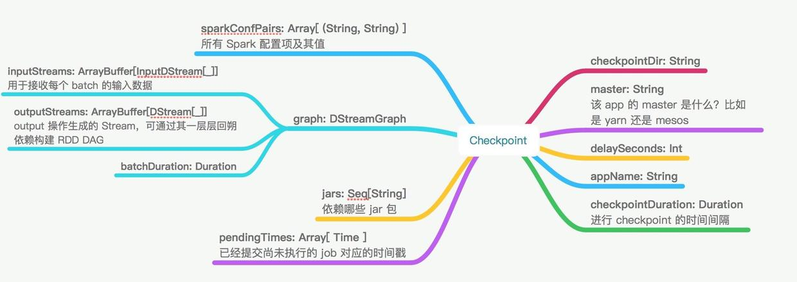

spark源码
#入口 
* spark shell 入口： 
* driver program入口：SparkContext
* worker 入口：Worker.scala
* driver ui 入口：
* (SparkContext)->SparkUI.scala->WebUI.scala
	- jetty server 的启动：bind()->startJettyServer
* cluster ui 入口：
* yarn scheduler 入口：
* network 层入口：
	* driver 端
	* worker 端

#Scheduler
SparkContext 初始化时创建.  
入口：  
 
```
    // Create and start the scheduler
    val (sched, ts) = SparkContext.createTaskScheduler(this, master, deployMode)
    _schedulerBackend = sched
    _taskScheduler = ts
    _dagScheduler = new DAGScheduler(this)
    _heartbeatReceiver.ask[Boolean](TaskSchedulerIsSet)

    // start TaskScheduler after taskScheduler sets DAGScheduler reference in DAGScheduler's
    // constructor
    _taskScheduler.start()
```

##SchedulerBackend:
A backend interface for scheduling systems that allows plugging in different ones under TaskSchedulerImpl. We assume a Mesos-like model where the application gets resource offers as machines become available and can launch tasks on them.   

更高层的scheduler,负责实现 mesos,yarn 等接口。 也就是对应了master 的配置，不同模式下的scheduler策略。  

* standalone：StandaloneSchedulerBackend (CoarseGrainedSchedulerBackend)
* yarn-cluster:YarnClusterSchedulerBackend (YarnSchedulerBackend)
* yarn-client: YarnClientSchedulerBackend (YarnSchedulerBackend)
* mesos: CoarseMesosSchedulerBackend，MesosSchedulerBackend (CoarseGrainedSchedulerBackend)
* local：LocalSchedulerBackend


##DAGScheduler: 
 
将任务分解成 stage（TaskSets），然后调用 TaskScheduler 进行 Task level 的 scheduler。这里最主要的关注submitJob（）核心实现。查看一个 job 是如何分解，如果提交的。

* The high-level scheduling layer that implements stage-oriented scheduling. It computes a DAG of stages for each job, keeps track of which RDDs and stage outputs are materialized, and finds a minimal schedule to run the job.
*  It then submits stages as TaskSets to an underlying TaskScheduler implementation that runs them on the cluster. A TaskSet contains fully independent tasks that can run right away based on the data that's already on the cluster (e.g. map output files from previous stages), though it may fail if this data becomes unavailable.
*  the DAGScheduler also determines the preferre locations to run each task on, based on the current cache status, and passes these to the low-level TaskScheduler.

两个重要问题：
1.Task 的相关信息dispatch传输到 executor 上的，居然是通过 sc.broadcast?   
2. 调用 taskscheduler 去 submit TaskSet
```
 // TODO: Maybe we can keep the taskBinary in Stage to avoid serializing it multiple times.
    // Broadcasted binary for the task, used to dispatch tasks to executors. Note that we broadcast
    // the serialized copy of the RDD and for each task we will deserialize it, which means each
    // task gets a different copy of the RDD. This provides stronger isolation between tasks that
    // might modify state of objects referenced in their closures. This is necessary in Hadoop
    // where the JobConf/Configuration object is not thread-safe.
    var taskBinary: Broadcast[Array[Byte]] = null
    try {
      // For ShuffleMapTask, serialize and broadcast (rdd, shuffleDep).
      // For ResultTask, serialize and broadcast (rdd, func).
      val taskBinaryBytes: Array[Byte] = stage match {
        case stage: ShuffleMapStage =>
          JavaUtils.bufferToArray(
            closureSerializer.serialize((stage.rdd, stage.shuffleDep): AnyRef))
        case stage: ResultStage =>
          JavaUtils.bufferToArray(closureSerializer.serialize((stage.rdd, stage.func): AnyRef))
      }

      taskBinary = sc.broadcast(taskBinaryBytes)
    } catch {
      // In the case of a failure during serialization, abort the stage.
      case e: NotSerializableException =>
        abortStage(stage, "Task not serializable: " + e.toString, Some(e))
        runningStages -= stage

        // Abort execution
        return
      case NonFatal(e) =>
        abortStage(stage, s"Task serialization failed: $e\n${Utils.exceptionString(e)}", Some(e))
        runningStages -= stage
        return
    }

    val tasks: Seq[Task[_]] = try {
      stage match {
        case stage: ShuffleMapStage =>
          partitionsToCompute.map { id =>
            val locs = taskIdToLocations(id)
            val part = stage.rdd.partitions(id)
            new ShuffleMapTask(stage.id, stage.latestInfo.attemptId,
              taskBinary, part, locs, stage.latestInfo.taskMetrics, properties, Option(jobId),
              Option(sc.applicationId), sc.applicationAttemptId)
          }

        case stage: ResultStage =>
          partitionsToCompute.map { id =>
            val p: Int = stage.partitions(id)
            val part = stage.rdd.partitions(p)
            val locs = taskIdToLocations(id)
            new ResultTask(stage.id, stage.latestInfo.attemptId,
              taskBinary, part, locs, id, properties, stage.latestInfo.taskMetrics,
              Option(jobId), Option(sc.applicationId), sc.applicationAttemptId)
          }
      }```

##TaskScheduler
 
核心还是TaskSchedulerImpl
  
* standalone：TaskSchedulerImpl
* yarn-cluster:YarnClusterScheduler （TaskSchedulerImpl）
* yarn-client: YarnScheduler （TaskSchedulerImpl）
* mesos: TaskSchedulerImpl
* local：LocalSchedulerBackend

由DAG Scheduler 调用过来的submitTask  

```
  override def submitTasks(taskSet: TaskSet) {
    val tasks = taskSet.tasks
    logInfo("Adding task set " + taskSet.id + " with " + tasks.length + " tasks")
    this.synchronized {
      val manager = createTaskSetManager(taskSet, maxTaskFailures)
      val stage = taskSet.stageId
      val stageTaskSets =
        taskSetsByStageIdAndAttempt.getOrElseUpdate(stage, new HashMap[Int, TaskSetManager])
      stageTaskSets(taskSet.stageAttemptId) = manager
      val conflictingTaskSet = stageTaskSets.exists { case (_, ts) =>
        ts.taskSet != taskSet && !ts.isZombie
      }
      if (conflictingTaskSet) {
        throw new IllegalStateException(s"more than one active taskSet for stage $stage:" +
          s" ${stageTaskSets.toSeq.map{_._2.taskSet.id}.mkString(",")}")
      }
      schedulableBuilder.addTaskSetManager(manager, manager.taskSet.properties)

      if (!isLocal && !hasReceivedTask) {
        starvationTimer.scheduleAtFixedRate(new TimerTask() {
          override def run() {
            if (!hasLaunchedTask) {
              logWarning("Initial job has not accepted any resources; " +
                "check your cluster UI to ensure that workers are registered " +
                "and have sufficient resources")
            } else {
              this.cancel()
            }
          }
        }, STARVATION_TIMEOUT_MS, STARVATION_TIMEOUT_MS)
      }
      hasReceivedTask = true
    }
    backend.reviveOffers()
  }    

```

##Worker端
Worker 作为主进程，管理了多个 executor 的信息和启动
启动一个 workThread来启动ExecutorRunner,具体负责 Executor 进程的启动。
#Storage
<http://www.aboutyun.com/thread-9619-1-1.html>

把数据存储到 disk，memory 上，或者 replicate到远端。
* BlockManager 作为外部与 Storage 交互的统一的操作接口。


#Cache,Persistence,
#CheckPoint  
  sparkContext.setCheckpointDir()  
    
 * spark的checkpoint目录在集群模式下，必须是 hdfs path。因为在集群模式下，实际上 checkpointed RDD 是从executor machines 的 check point files 里面加载而来。

##RDD CheckPoint
* 实际上是利用 hdfs 的冗余来实现高可用。
* 文件rdd-x保持的是 该rdd 的 信息。 
* 如果 rdd1.checkpoint(), 那么 后面依赖 rdd1的 rdd2 在计算时加载 rdd1实际上是从 checkpoint产生的eliableCheckpointRDD而来，（而不是从 rdd0->rdd1重新计算）。
* 如果 rdd1.persist()并且 checkpoint 了，会优先加载 cache 里面的，然后是 checkpoint 里面的。

##Streaming CheckPoint
Streaming里面的 checkpoint 又有其特殊的重要性。除存储某个 DStream 的数据外，还存储了环境相关信息。数据的 checkpoint 的目的同上，为了切断过长的依赖，使后面的操作的依赖更可口。而 metadata 的 checkpoint 是为了更好的恢复 driver。
Spark Streaming 会 checkpoint 两种类型的数据。  
  
* Metadata（元数据） checkpointing - 保存定义了 Streaming 计算逻辑至类似 HDFS 的支持容错的存储系统。**用来恢复 driver**，元数据包括：
配置 - 用于创建该 streaming application 的所有配置
DStream 操作 - DStream 一些列的操作
未完成的 batches - 那些提交了 job 但尚未执行或未完成的 batches  
* Data checkpointing - 保存已生成的RDDs至可靠的存储。这在某些 stateful 转换中是需要的，在这种转换中，生成 RDD 需要依赖前面的 batches，会导致依赖链随着时间而变长。为了避免这种没有尽头的变长，要定期将中间生成的 RDDs 保存到可靠存储来切断依赖链

###什么时候需要启用 checkpoint？
* 有重要的过长的计算依赖
* 用了一些全局的变量，比如stateful，broadcast 等
* 希望从application从 driver 中恢复，注意需要重写 functionToCreateContext
<http://www.jianshu.com/p/00b591c5f623>

* 随着 streaming application 的持续运行，checkpoint 数据占用的存储空间会不断变大。因此，需要**小心设置checkpoint 的时间间隔**。设置得越小，checkpoint 次数会越多，占用空间会越大；如果设置越大，会导致恢复时丢失的数据和进度越多。一般推荐设置为 batch duration 的5~10倍



注意：类 Checkpoint 对象序列化后的数据，在 Spark Streaming application **重新编译**后，再去反序列化 checkpoint 数据就会失败。这个时候就必须新建 StreamingContext。解决方案：对于重要的数据，自行维护，比如 kafka 的offset。  
TODO check: offset checkpoint metadata or hdfs 存 or
 zookeeper存 比较。

# Persistent vs CheckPoint
Spark 在生产环境下经常会面临transformation的RDD非常多（例如一个Job中包含1万个RDD）或者具体transformation的RDD本身计算特别复杂或者耗时（例如计算时长超过1个小时），这个时候就要考虑对计算结果数据的持久化。如果采用persist把数据放在内存中，虽然是快速的，但是也是最不可靠的；如果把数据放在磁盘上，也不是完全可靠的！例如磁盘会损坏，系统管理员可能清空磁盘。持久化的方向可以是 persistent 或者 checkpoint。 当两者目的又有所不同。

1. cache/persistent 可以说一方面是为了提速，另一方面是为了当某一重要步骤过长，后面的依赖出错（可能是逻辑错误）情况下，可以无需从头算起。
2. checkpoint：则更多的是为了高可用。其核心另的还是 hdfs 的 replicaton.其情形是集群总某个点的硬件设备坏掉，例如 persistent 中某个盘坏了，整个应用仍然是可用的。Checkpoint的产生就是为了相对而言更加可靠的持久化数据，在Checkpoint的时候可以指定把数据放在本地，并且是多副本的方式，但是在生产环境下是放在HDFS上，这就天然的借助了HDFS高容错、高可靠的特征来完成了最大化的可靠的持久化数据的方式；

3. Checkpoint是为了最大程度保证绝对可靠的复用RDD计算数据的Spark高级功能，通过checkpoint我们通常把数据持久化到HDFS来保证数据最大程度的安全性；

4. Checkpoint就是针对整个RDD计算链条中特别需要数据持久化的环节（后面会反复使用当前环节的RDD）开始基于HDFS等的数据持久化复用策略，通过对RDD启动checkpoint机制来实现容错和高可用；

加入进行一个1万个步骤，在9000个步骤的时候persist，数据还是有可能丢失的，但是如果checkpoint，数据丢失的概率几乎为0。

理解spark streaming 情形下的数据丢失，对 checkpoint 非常重要
<http://spark.apache.org/docs/latest/streaming-programming-guide.html#fault-tolerance-semantics>

### zero data loss 保证
Write Ahead Log+ reliable receivers（收到数据之后

#Shuffle
Spark shuffle 是 pluggalbe的，核心接口在 ShuffleManager,可在配置文件中配置，具体在 SparkEnv 里面读取配置。
<https://0x0fff.com/spark-architecture-shuffle/>
<http://www.cnblogs.com/zlslch/p/5942590.html>
* Hash-Based Shuffle：M*R个临时文件，每个 map task 一个。
  consalidate：C*R个，每个 core 产生一个大的合并文件。

* Sort-Based Shuffle：2*M 个。每个 map task产生两个，一个是 data 本身，另一个是 data index，存在 map端。reducer 端根据 index 获取自己的数据。

* Tungsten-sort Shuffle：

#RPC 层
ThreadSafeRpcEndpoint
NettyRpc
	

#Spark 2.0
##SparkSession