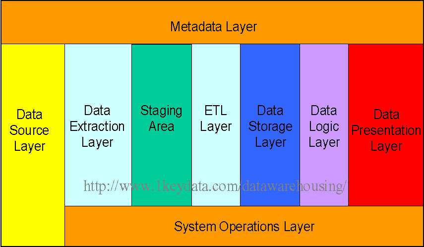

#前言
 数据仓库作为大数据技术最重要的组件之一, 是大部分数据分析和算法的底层存储中心,
 在最近几年来随着大数据的蓬勃发展而为业界所知, 但是真正系统化深入介绍该领域的仍然比较少。
 笔者因最近几年的工作均对此有所涉猎, 同时有感于相较于业务系统的底层技术-数据库而言，众多的从业人员对数据仓库也是一知半解的状况, 
 而市面上真正的系统的综合性介绍也相对较少，故开篇作此文。

#什么是数据仓库
   数据仓库, 最早有由数据仓库之父比尔·恩门（Bill Inmon）于1990年提出,主要功能是将组织透过资讯系统之联机事务处理(OLTP)经年累月所累积的大量资料，透过数据仓库理论所特有的资料储存架构，进行系统的分析整理，
 以利于各种分析方法如联机分析处理(OLAP)、数据挖掘(Data Mining)之进行，并进而支持如决策支持系统(DSS)、主管信息系统(EIS)之创建，帮助决策者能快速有效的自大量资料中，分析出有价值的资讯，以利决策拟定及快速回应外在环境变动，帮助建构商业智能(BI)。
 
  目前, 被广泛接受的数据仓库的定义是由Bill Inmon在1991年出版的 "Building the Data Warehouse"一书中所提出的，其定义如下:
  数据仓库(Data Warehouse)是一个*面向主题*的(Subject Oriented)、**集成**的(Integrated)、**反映历史变化**(Time Variant)、**相对稳定**的(Non-Volatile)的数据集合，用于支持管理决策(Decision Making Support)。
  其实，在大数据时代，随着机器学习和人工智能的兴起，我觉得这个定义应该可以做个少许的修正，数仓仓库不只是是用于构建支持管理决策的商业智能BI的基础, 也是大量的机器学习和人工智能算法的底层基础之一。
 
  展开来讲:
  * 面向主题的(Subject Oriented)：数据仓库是用来分析特定的主题域的。比如, "sales"就是一个特定的主题域。  
    这是数据仓库也是区别于常见的操作型数据库的最重要的特征(操作型数据库如Mysql是面试事务处理的)。  
    这个一个非常关键的点，它是贯穿数据仓库建设过程的始终的，而并非某个阶段的，是数仓设计者和使用者始终该牢记心中的。笔者见过很多的数据仓库的模型建设，或多或少的偏离了这个核心点。
    其中，"主题"二字的理解，也是非常重要的。何为"主题"？我个人的理解是对你所要分析的一系列的业务领域问题的上层归类(此处欢迎大家拍砖)。  
    总结好这个"主题"的前提是对业务域的理解，同时也决定了你的数仓设计方法是会采用自顶而上的方式还是自底而下的方式(后面再详谈)。  
    
  * 集成的(Integrated): 数据仓库集成了多个数据源，某个产品的相关源数据可能存在不同类型的数据库中、缓存中、日志文件中等。 
    例如：数据源A和数据源B可能是识别某个产品的不同的方向，但是在数据仓库中，仅有一个方式来识别某个产品, 对于同一产品中分散在不同的数据源中的**不同信息**数据仓库需要进行数据抽取、清洗、整合;
    对于分散在不同的数据源中的同一冗余信息则需要消除不同数据源的不一致性，以保证数据仓库内的信息是关于整个企业/业务/主题的**一致**的**全局**信息。
      
  * 反映历史变化**(Time Variant): 数据仓库保存的是比较长期的历史数据，这点是相对数据库而言, 因为后者通常保持是是最近一段时间的数据。
    例如:我们可以从数据仓库中获取3个月, 6个月，12个月甚至10年的订单数据; 而数据库里可能只能获取最近3年的订单数据。
    数据仓库中的关键结构都隐式或显式地包含时间元素。
  
  * 相对稳定的(Non-Volatile): 一个数据一旦进入数据仓库，则不可改变。数据仓库的历史数据是不应该被更新的。
    Non-Volatile在有的文档里面会翻译成不可更新。这里用的是相对稳定，是一个比较准确的描述。    
    个人理解，主要反映在以下几个方面：(欢迎大家补充)
    ** 一是历史一旦形成，不可更改。几乎所有的数据仓库产品都不支持更新修改操作，但是是支持重载操作，所以是相对的，而非绝对不可更改。  
    (YY一下，一方面是尊重历史，另一方面也给数据作假和数据篡改带来难度。当然如果你从数据源上篡改数据，那当然是方便得多。）
    * 存储的稳定性(非易失的))，数据在数据仓库中是存储在稳定的底层存储介质文件中的，而不会存储在cache中、内存中; 同时数据仓库产品应该具备相应的安全措施
       以防止重要的历史数据丢失(因为一旦丢失，可能就是真的失去，同时也就失去的对历史的认知)。  
    * 数据仓库大都保存的是长期的历史数据，大都以只读的格式保存, 基本是稳定的，记录已然发生的历史事实数据基本不随未来的时间变化而改变。     
      
   另外, Ralph Kimball提供了一个更为简洁的定义：
   "A data warehouse is a copy of transaction data specifically structured for query and analysis"
   数据仓库其实质就是一种专门为查询和分析而构建的事务性数据的拷贝。 这其实是单纯的从功能的视角来定义的。[我倒觉是单纯的从技术实现的视角来看的:-), 的确如此。]
 
 参考： https://www.1keydata.com/datawarehousing/inmon-kimball.html   

#数据仓库的发展历史和成熟度模型
  数据仓库和数据库一样历史悠久，但是显然并没有如数据库技术一样，被广大技术人所熟知。
  随着大数据和人工智能的兴起，我觉得这些数据仓库作为面向未来的基础之一，应该被软件开发工程是、数据工程师、数据分析师、算法工程师、算法科学家所共知。
  笔者最早接触数据仓库这一概念的时候，是来自研究生数据挖掘方向导师 推荐的必修课书籍《数据挖掘概念与技术》(韩家炜版), 但是当时，完全不知道是讲什么，跟数据挖掘的关系是什么，
  而后作数据挖掘相关研究时候，也没有使用过数据仓库产品，所以一直是半懵逼状态。在工作后从事BI软件的开发，大数据开发以及其他的数据工程之后，才真正把这些东西完全串通起来。
  前两年再重温这本书以及相关数据仓库书籍时，已然是比较通透了。然而在教育界，可能随着时代的发展，大数据相关课程也在一些学校兴起，但是与真实的工业界的发展还是有差距的。
  而在工业界，各种概念漫天飞舞，参差不齐，很多人会在概念上将hive等同于数据仓库, 这显然同把mysql等同数据库的犯的错误是一样的。
  
  早在1983年，数据仓库的雏形就诞生了，也就是**原子数据**。对粒状的，整合的历史数据的需求催生了前所未有的数据处理方式。  
  1990年，ETL出现了，有了ETL, 很多遗留下来的应用环境数据就可以访问和集成了。ETL大大促进了商务智能的发展。世界顶级BI软件公司微策略也是诞生这段时期。  
  1994年左右, 数据仓库出现了各种各样的扩展。比如多维的OLAP数据计算，探索性数据仓库和ODS。正式在这个时期，数据仓库演变成企业信息工程(CIF)。
  在2000年左右出现了网络大爆炸，这个事情，DSS应用软件出现了，企业的绩效管理成为现实。此外，适应性数据集市出现在商务智能领域。适应性数据集市是一个临时的结构，
  有一些数据集市和探索型数据仓库的特点。
  CIF起源于数据仓库。美国911事件发生以后，政府信息工厂(GIF)就出现了。（CIF和GIF之间的区别之一就是数据分享和集成的范围有所不同).
  从数据仓库除非演变到企业的信息工厂(CIF)。CIF的中心就是数据仓库。环绕着CIF就是体系实体，例如数据集市，探索型数据库，ODS等等。 
  互联网行业的数据仓库和之前的传统的数据仓库就用途而言，差别不大，且都要求数据仓库具有较好的稳定性和可靠性。近几年来，大的互联网由于数量量大，业务繁多，
  基本都会围绕数据仓库建立数据平台，阿里的ODPS就是这样一个大数据平台。互，
  
  
  2017年, TDWI(Transforming Data With Intelligence)提出了一个数据分析成熟度模型(仅供参考), 来衡企业组织内数据分析的成熟度水平。这个模型提供了一分析项目的全貌，告诉你
  现在在哪，下一步该走向哪，你应该集中精力在哪块去创造你数据的价值。（才发现该Paper居然来自前司的support，瞬间有丝丝商业软文的感觉）
  
      
  
  该模型有6个阶段组成：孕育期、婴儿期、儿童期、少年期、成人期、长者期。此处只作简述，有兴趣的同学可以详见附件论文。
  * 孕育期(Spreadsheet)：大多数组织都有一个报表系统、制作、打印一堆标准报表，并定期分发给员工，常常是每周、每月、每季度。
  * 婴儿期(Spreadmarts)：这个阶段可能是通过Excel表格或桌面数据库等Spreadmarts来完成数据集市的功能。每个Spreadmarts包含一系列单独的数据、标准、规则。
    Spreadmarts之间相互不统一，和报表、分析系统之间也不统一。但是，由于Spreadmarts方便，简单，它无处不在，几乎所有的组织都有大量的Spreadmarts。
    但Spreadmarts让组织(或者CEO)无法得到一个清晰、统一的数据全貌。Spreadmarts 很难消除，因为使用方便，自由。只有在企业到达了最后两个阶段时，
    本地控制和整个组织的数据才能有效的整合在一起。
  * 儿童期(Data Marts): Data marts是指一个共享的分析结构，支持一个单独的应用程序，业务流程或者部门。
    各部门的人员搜集本部门的需求并以此对data  mart进行裁剪，用来满足本部门的需求。它能很好的满足本部门的需求，
    但是如果有跨部门的分析需求时，它就显得力不从心了。
  * 少年期(Data Warehouse):  在创建了几个data marts之后，大多数的部门会意识到，他们需要把一些数据定义、规则、维度标准化，以防止将来的数据整合噩梦。
    于是就数据仓库就形成了。为了更好的监控企业中跨部门的流程和企业的价值链，企业还会部署仪表盘程序，仪表盘程序的价值在于，它让企业中更多的人从商务智能中受益，
    而不仅仅是少数的高级用户。这样，在决策层的眼里，DW/BI可以提高企业的效率，让更多的用户获得信息，并在这些信息基础上做出决定，而不是拍脑袋做决定。
  * 成人期(EDW):尽管数据仓库带来许多好处，但是仍无法完全解决数据一致性的问题。或者是因为内部开发，或者是因为企业并购，当今许多企业有不止一个数据仓库。
    在成人期，企业强调唯一的可靠的数据来源，用以反映事实。在成人期，企业级数据仓库作为企业内战略性的资源，用于整合数据来支持一些驱动业务的关键应用程序。
    在成人期，数据仓库带来的价值开始超过对其的投资了，尤其是在规模经济和快速开发上（见图3）。
    而且，这时候用户开始发现数据仓库的新的用途，这些用途甚至当时的开发人员都没有预料到，这又进一步提高了投资回报率。
    
  * 长者期(BI): 一旦数据仓库变成战略性的企业资源并且和关键应用程序一起驱动整个业务，你的工作就基本做完了。一旦你的数据仓库进入了长者期，它的价值将指数级增长，而用户将渐渐感觉不到它的存在。
    作为BI服务，数据仓库和分析服务器退居幕后，变为基础设施的一部分。如果它不出问题，你甚至察觉不到它的存在。在社会发展过程中，我们接受了无数的服务，例如电力，污水处理，交通，等等。BI服务也将成为下一个这样的服务。
    
  
  你可以参考该模型，根据公司和企业的规模来通来评估你的分析平台的成熟度。具体来讲，可以通过下面5个层面的成熟度来进行（详见下图的框架):
  * Organization(组织): 公司战略、文化、领导力、资金等方面是何种粒度支持自助分析服务的？分析已然广泛的用于日常决策了吗？
   （我阿里的支持粒度绝对是国内数一数二的。）
  * DATA MANAGEMENT(数据管理): 自助服务应该对企业提供灵活且非常可靠的数据，公司如何管理支撑自助分析的数据？  
    公司如何处理数据质量问题以及数据准备、集成和获取问题？
  * INFRASTRUCTURE(基础设施)：数据是任何一个分析活动(analytics initiative此处没找到更贴切的翻译，请读者自行体会)的关键部分。用户支撑
    自助分析活动的体系架构是一致的、先进的吗？底层的基础设施支撑公司所有部门和潜在用户的自助分析到了哪种程度？能够满足性能要求吗？
    是否利用了新的计算来支持需求？
  * ANALYTICS(分析)：自助分析的范围是什么?业务分析人员、IT人员和其他量化人员之外的用户能够使用它做什么？
    这里面包括各种不同的分析(方法)的使用以及结果如何发布到组织机构。当然也包括培训。
  * GOVERNANCE(管理)：公司里面支撑自助分析的数据管理策略是一致的吗？公司能够管理用户的数据发现和数据探索吗？
    是否设置了太多的限制而阻碍了用户对(数据)洞见的探索？所有的政策都是到位的，合适的吗？是有专人负责的吗？
  
  
    
参考：https://cloud.tencent.com/developer/article/1102315
英文原文：https://tdwi.org/pages/maturity-model/analytics-maturity-model-assessment-tool.aspx?m=1

#数据仓库系统的体系架构
虽然不同的数据仓库系统有不同的结构, 但大体上而言，基本所有的数据仓库系统都有以下几层(来自Kimball的划分)：
  
* Data Source Layer : 源数据层, 这层表示将要feed到数据仓库各种数据源。
  可以分为以下几个类别：操作型的数据、日志数据、内部市场调研数据、第三方数据(如人口普查数据)
* Data Extraction Layer : 数据抽取层, 表示从源数据里面基本不做转换的拉到数据沧海的数据 (个人更倾向于将其理解为数据连接层，这样更便于后面的ETL层区分开来)。
* Staging Area : 数据准备(聚集)区, 这层数据通常存在数据仓库或者数据集市中。这样一个公共区的存在是为了后续进一步的数据处理和整合更加便利。
* ETL Layer：ETL层，这层使得数据具有了"Intelligence"属性， 因为该层主要的逻辑是将具有事物属性的数据转换成具有分析属性。
* Data Storage Layer： 数据存储区, 数据储存层里面存储的是已经经过ETL转换的干净的数据。根据不同的功能和范畴，存储层可以分为类型的实体ODS、Data Mart、Data Warehouse。
    在一个给定的系统里面，你可能拥有三个实体中的其中一个或者二个或者全部。
* Data Logic Layer： 数据逻辑层, 这是商业规则的存储层。该层的存在不影响底层的数据转换规则，但是影响上层的报表展示形式。
* Data Presentation Layer： 数据展示层, 这层涉及信息如何到达用户。它可能是浏览器中的表格或者图表报表，或者是每日自动生成并发送的Email报表，或者是一些异常警告等等形势。
* Metadata Layer：元数据层，该层用于描述数据仓库存储的数据。
* System Operations Layer： 系统操作层，该层包括了数据仓库系统中操作的信息，比如ETL任务的状态、系统的性能，用户access记录等。

其中Data Storage Layer中，ODS、Data Mart、Data Warehouse中三个概念相对较难理解，再展开下：  
**ODS(Operational Data Store)**  
数据库用户ODS数据层主要管理把业务数据层的数据存储到ODS数据层，它的数据表主要就是来源于业务数据表，通过一些存储过程把业务数据表结构改变成基层的数据仓库的表结构。  

ODS是一个面向主题的、集成的、可变的、当前的细节数据集合，用于支持企业对于即时性的、操作性的、集成的全体信息的需求。常常被作为数据仓库的过渡，也是数据仓库项目的可选项之一。

为什么需要有一个ODS系统呢？一般在带有ODS的系统体系结构中，ODS都具备如下几个作用：
1） 在业务系统和数据仓库之间形成一个隔离层。
2） 转移一部分业务系统细节查询的功能。
3） 完成数据仓库中不能完成的一些功能。 

在实际应用中，如果ETL过程中从业务数据表映射到数据仓库比较复杂，可以考虑ods这个中间层。有点类似中间表，这样可以方便开发人员debug，查看数据出错的环节。然后再从ods层到数据仓库层进一步映射。比如说你的基础事实表，涉及多个业务数据源的融合或者join等。

##Data Warehouse vs Data Mart
简单的说：数据仓库是面向整个企业的，而数据集市可能是面向部门或者某个地区的分公司等。类似于中国电信和中国电信浙江分公司关系。
数据仓库的设计方法论上有两种方式：自顶向上，自上向下。这样，你可以先有数据集市提取组织成你的数据仓库，也可以先有数据仓库，然后通过地区粗维度生产中间数据作为部分或者区域性的数据集市。  
**DW数据层**  
数据库用户DW主要管理把ODS数据层的数据存储到DW数据层，它的数据表主要就是来源于ODS数据表，通过一些存储过程把ODS数据表结构改变成项目主题数据仓库的表结构。
DW数据层还管理一些对存储过程的记录表，方便数据仓库的维护和管理。

从技术实现的角度来讲，一个完整的数仓体系大都要解决下面的几个重点问题：
* 元数据管理：回答"数据仓库里面的数据是怎么样"的问题。-"元"。
* 数据采集：解决如何将源数据进入数据仓库。-"入"。
* 数据存储与计算：回答数据如何存储？如何计算？- "存" "算"
* 调度与监控：如何调度采集、存储、计算任务？如何监控这些任务？-"调度"
* 数据应用：解决如何将数据仓库的数据 -"出" "用"

#数据仓库的设计
##数据仓库项目的生命周期
一个完整的数据仓库应用项目的周期，可能包括下面几个步骤:
* Requirement Gathering: 需求收集阶段，这块数据开发工程区别于一般业务应用系统开发工程比较难以控制的一步。
                        一方面一般用户很难清楚的知道自己的真实需求, 另外一方面很多的深层次需求是在看到数据之后才能，用户才能想到的。
* Physical Environment Setup: 这块包括两块, 一块是物理机器的准备，另外一块是相关软件、工具的选址和安装。在阿里这块比较简单, 整个odps的生态系统已经很完善了。大家基本可以忽略。
* Data Modeling: 数仓数据模型的建立是数仓项目非常重要的步骤，包括物理模型和逻辑模型两部分。对于已有数仓的基础设施的企业而言，则主要需要做的是数据模型的建立。
* ETL: ETL是数仓项目中不是技术最难的一步，但是却是最重要最耗时的一步。实际生产中的数据总数由于各种原因导致各种难以预料数据问题，除非你在调研阶段看到了每一条数据，
       否则你永远无法精确预知它所消耗的时间工时。
* OLAP Cube Design: 这块涉及与Data Modeling所设计的数据模型紧密相关, 它源于Requirement Gathering, 但是应该不限于你所收集到的需求，你的设计应该尽可能的让它满足
       当前和未来可能的需求。
* Front End Development: 不管OLAP和数据整合的多强, 如果用户无法可视化报表, 数据仓库的价值对应用户而言, 则是0. 
        所以前端的开发对于数据仓库项目的启动非常重要，不过你不是非要一个前端开发来参与项目，除非现有的可视化工具(一般有BI工具提供)不能满足你的可视化需求。
  * Report Development: 报表的开发工作, 报表的specification通常直接来源于需求阶段。对应终端用户而言，最直接的就是他们直接要求的报表样式。  
                但有时候，受限于实际数据情况、BI工具的支持情况、工时影响等，最终可能并非完全是用户所要求的展示样式。
                另外有些时候，最终用户所要求的样式，并非他所想说明问题的最佳展示方式，这时候都需要开发人员主动把握。
* Performance Tuning: 调优并非在所有的应用中都会遇到。调优主要可能存在三个阶段中：ETL阶段、Query Process阶段、Report Delivery阶段。另外也应该包括对存储和计算的调优。
    * 其中Query Optimization比较重要, 这块最主要的是计算任务的调优，计算任务的执行周期，决定了你后续报表更新的周期。
* Quality Assurance: 质量保障，很少有公司会为数仓项目设立独立的AQ team来对结果进行测试，或者说QA通常来自于最终的用户。一般的QA team对数仓知之甚少。
      因此，实际中，通常这一步骤被skip了。
* Rolling out to Production: 生产环境发布。
* Production Maintenance: 生产环境维护。一旦进入生产环境，数据仓库必须维护。
* Incremental Enhancements: 迭代改进。在业务变化迅速的事情，迭代改进基本是必须的。
实际过程中，上面的步骤并不会严格执行。而且，在互联网行业的数据仓库，由于数据和业务变化迅速，所以可以称之为当代的数仓开发过程为敏捷数据仓库开发。

##数据模型设计
数据仓库的设计方法主要有自顶向下和自底向上两种方式，这个大家一般比较容易理解。
但具体采取哪种方式，实际取决于企业内部业务的大小，一般对于比较大型的企业有中业务，自顶向下的方式会比较不现实，因为没有人能全局把握所有的业务，
而对于小公司而言，时间允许的情况下，自顶向下则更佳。

数仓建模的主要有三种方法：维度建模法、实体建模、3NF建模。其中实体建模和3NF建模比较不常用，了解一下即可，此处重点介绍常用的维度建模方法。
根据维度维度建模法可以创建下面3种模型：
* 星型：简单事实和维表 
    
* 雪花型：在星型基础上，分解维表 
   
* 星系型：多个事实表的雪花型的组合

多维数据模型的优缺点　
* 优点：  
　　多维数据模型最大的优点就是其基于分析优化的数据组织和存储模式。举个简单的例子，电子商务网站的操作数据库中记录的可能是某个时间点，某个用户购买了某个商品，并寄送到某个具体的地址的这种记录的集合，于是我们无法马上获取2010年的7月份到底有多少用户购买了商品，或者2010年的7月份有多少的浙江省用户购买了商品？但是在基于多维模型的基础上，此类查询就变得简单了，只要在时间维上将数据聚合到2010年的7月份，同时在地域维上将数据聚合到浙江省的粒度就可以实现，这个就是OLAP的概念，之后会有相关的文章进行介绍。

缺点：  
　　多维模型的缺点就是与关系模型相比其灵活性不够，一旦模型构建就很难进行更改。比如一个订单的事实，其中用户可能购买了多种商品，包括了时间、用户维和商品数量、总价等度量，对于关系模型而言如果我们进而需要区分订单中包含了哪些商品，我们只需要另外再建一张表记录订单号和商品的对应关系即可，但在多维模型里面一旦事实表构建起来后，我们无法将事实表中的一条订单记录再进行拆分，于是无法建立以一个新的维度——产品维，只能另外再建个以产品为主题的事实表。

　　所以，在建立多维模型之前，我们一般会根据需求首先详细的设计模型，应该包含哪些维和度量，应该让数据保持在哪个粒度上才能满足用户的分析需求。
　　
维度模型中概念简介(Fact,Attribute,Dimension,Metric)  
* Fact:对于detail的某些数字类型的列， Metric则为在事实列基础上进行的聚合函数的计算结果。事实表则有需要用户group by的attribute和fact 列组成。
* Attribute:为业务表中的某些列，需要i走 group 的列
* 多个Attribute 组成 Dimension。当然单个attribute也可以是1维的dimension。
* Metric(Measure):需要考察的数据指标/度量。通常在事实表或者其他中间表的某些列上做聚合而成。

* Slowly Changing Dimension  
在数据仓库的实际建设过程中，还有普遍面临的问题是Slowly Changing Dimension(缓慢变化维度)：
例如：
Christina是ABC公司的一个客户，最初她住在Chicago, Illinois。所以，最早的记录是这样子的:

|Customer Key|Name|State|
|:------|:------|:------|
|1001|Christina|Illinois|

一段时间之后，她迁居到了Los Angeles, California(January, 2003), 那么ABC公司如何更改上表来反应这种变化呢？
这就是一个简单的"Slowly Changing Dimension"问题。
一般来讲，我们有三种方式来解决这类问题：

Type 1: The new record replaces the original record. No trace of the old record exists.
在上例中，则替换原始记录，则变成：

|Customer Key|Name|State|
|-------|------|------|
|1001|Christina|California|

这是最简单的方式，我们有50%的case是这么干的，但是会损失重要的历史信息。

Type 2: A new record is added into the customer dimension table. Therefore, the customer is treated essentially as two people.
在上例中，新的记录会添加进表格中：

|Customer Key|Name|State|
|------|------|------|
|1001|Christina|Illinois|
|1005|Christina|California|
这种方式会保留所有的历史记录，但是数仓存储会迅速增长。也有50%的case是这样做的。

Type 3: The original record is modified to reflect the change.
在上例中，会扩展成一张宽表：  

|Customer Key|Name|Original State|Current State|Effective Date|
|------|------|------|------|------|
|1001|Christina|Illinois|California|15-JAN-2003|

在实际中，这种类型比较少用。如果这种变化是有限次的，可预估的，也可以使用。

* Factless Fact Table：没有事实的事实表可能看起来很愚蠢，但是在现实生活中，无事实的事实表时比较有用的。
例如：学生上课记录，这个case中，事实表包含3个维度：学生维度、时间维度、课程维度。无事实的事实表时这样子的：  

|STUDENT_ID|
|------|
|CLASS_ID|
|TIME_ID|

在数仓设计中，无事实的事实表是最简单也是最灵活的。如上图的表，虽然简单，它已经能够回答下面的两个问题：
* 在指定的某天，有多少学生参加了某堂课？
* 在给定的某天，学生平均参加了多少节课？

 在建立多维模型之前，我们一般会根据需求首先详细的设计模型，应该包含哪些维和度量，应该让数据保持在哪个粒度上才能满足用户的分析需求。

##维度，OLAP

其他参考：
 <http://www.cnblogs.com/mq0036/p/4155832.html>
 <http://www.myexception.cn/data-warehouse/1821560.html>
 <http://blog.itpub.net/23659908/viewspace-1118762/>
 <http://www.cnblogs.com/hadoopdev/p/4235257.html> 
 <http://webdataanalysis.net/web-data-warehouse/multidimensional-data-model/>  
 <http://www.cnblogs.com/wuhuacong/archive/2010/05/11/1732710.html>
 
 辛苦总结，转载请注明出处。谢谢！

